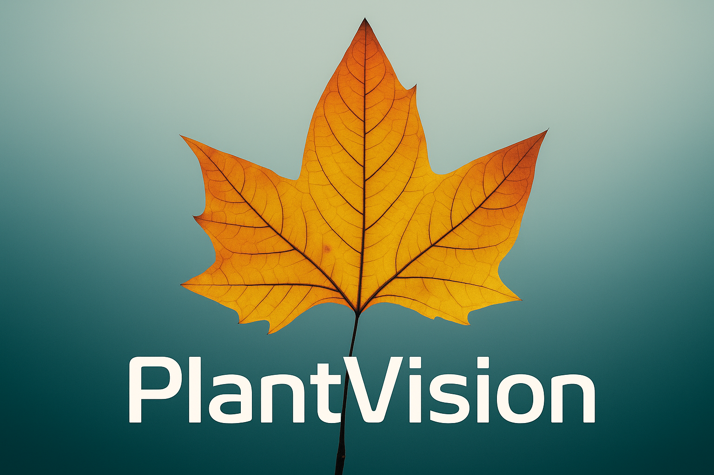

<p align="center">
  
</p>

<h1 align="center">Disease Detection</h1>

<p align="center">
  <strong>Identify plant diseases in a snap with state-of-the-art AI.</strong><br/>
  An EfficientNet model fine-tuned to recognize plant diseases from leaf images, available via a web API and an offline-first mobile app.
</p>

<!-- BADGES: Go to shields.io to create these. They make your project look professional. -->
<p align="center">
  <a href="https://github.com/MDeus-ai/PlantVision/stargazers"></a>
  <a href="https://github.com/MDeus-ai/PlantVision/blob/main/LICENSE"></a>
  <a href="#"></a>
  <a href="https://muhumuzadeus.netlify.app/projects/plantvision-cv001dd"></a>
</p>


**🌿PlantVision** is a deeplearning-powered plant disease detection system built
with Python and PyTorch. It leverages a CNN architecture (EfficientNet) to classify 84 
different kinds of plant diseases from 17 plants with a relatively high accuracy.


📚You can find the full project documentation [here](https://muhumuzadeus.netlify.app/projects/plantvision-cv001dd)

---
## 🤔 The Problem & Solution

Millions of farmers and gardeners worldwide lose crops to diseases that 
could be managed if caught early. Identifying these diseases often requires 
expert knowledge which isn't always accessible.

**PlantVision** bridges this gap by putting a plant pathologist in your pocket. 
By leveraging a highly efficient deep learning model, it provides an instant and accurate diagnosis from a single image of a plant leaf, 
helping to secure food resources and support sustainable agriculture.

## 📑 Table of Contents
| Section              | Link                                             |
|----------------------|--------------------------------------------------|
| ✨ Features           | [Jump to Features](#-features)                   
| 💡 Tech Stack        | [Jump to Tech Stack](#-Tech-Stack)               
| 🚀 Installation      | [Jump to Installation](#️-installation)          |
| ⚙️ Usage             | [Jump to Usage](#-Usage)                         
| 🛠️ Model Details    | [Jump to Model Details](#-dataset)               |
| 📱 Mobile Deployment | [Jump to Mobile Deployment](#-mobile-deployment) |
| 🤝 Contributing      | [Jump to Contributing](#-contributing)           |
| 📄 License           | [Jump to License](#-license)                     |
| 📬 Contact           | [Jump to Contact](#-contact)                     |

---

## ✨ Features

- **State-of-the-art Backbone:** Utilizes EfficientNet-B3 for robust feature extraction.
- **Offline Inference:** Optimized for deployment on mobile devices without internet connectivity.
- **Scalable:** The API is containerized with Docker for easy deployment and scaling.
- **Extensibility:** Modular design allows easy customization and extension for additional **plant species** or **diseases**.

---

## ⚙️ Tech Stack
| Component         | Technology                                                                                                                                                                                                                       |
| ----------------- |----------------------------------------------------------------------------------------------------------------------------------------------------------------------------------------------------------------------------------|
| **Model**         |                                         |
| **Backend (API)** |                  |
| **Mobile**        |  |


---

## 🚀 Installation

Follow these instructions to get the API running on your local machine.

### Prerequisites

- Python 3.8+
- Pip
- Git

### Installation

1.  **Clone the repository:**
    ```bash
    git clone https://github.com/MDeus-ai/PlantVision.git
    cd PlantVision
    pip install -e .
    ```

2.  **Create and activate a virtual environment:**
    ```bash
    python -m venv venv
    venv\Scripts\activate
    ```

3.  **Install the dependencies:**
    ```bash
    pip install -r requirements.txt
    ```

4.  **Download the model file:**
    (Link to the trained `.h5` or `.tflite` model file from Google Drive, etc.)
    ```bash
    # e.g., wget [plantvision_weights.h5] -O models/plant_disease_model.h5
    ```
5. **Use the model from the terminal:**
    ```bash
   python -m PlantVision.predict --image "path/to/image.png"
   ```
---
## ⚙️ Usage
### Command-Line (CLI) Usage
Using CLI to interact with PlantVision requires you to open it from the terminal e.g. `command prompt` for windows machines
#### 1. **Use the system to make a prediction:**
- You can use the model to make predictions on images anywhere on your computer by running the following command 
    ```bash
    python -m PlantVision.predict --image "path/to/image.png"
    ```
#### 2. **Train the model:**
- Training the model requires you to adapt the system to your custom dataset. This is be done by moving your dataset to the `data/` folder in the **project root** (create the folder if its not available)
- Your custom dataset should be organised with the following structure:
    ```text
    PlantVision/
    ├── data/
    │   └── train/
    │       ├── class_a/
    │       │    ├── 1.png
    │       │    └── 2.png
    │       ├── class_b
    │       │    ├── 3.png
    │       │    └── 4.png
    │       ├── class_c
                 ...
    ```
- Modify the configuration files in `PlantVision/configs/` to match your dataset
    - In `data_config.yaml`: Modify `train_dir` and `val_dir` to match your dataset's structure e.g., `train_dir: "train"` or `train_dir: processed/train/`
    - In `model_config.yaml`: Modify `num_classes` to the number of classes in your dataset e.g., `num_classes: 38`
- With these changes in place, you can now **train the system** with the following command:

    ```bash
    python -m PlantVision.train
    ```
- PlantVision will automatically register the class names in your dataset in `outputs/num_classes.json` file for `predict.py` and `evaluate.py` to use later
#### 3. **Evaluate the model:**
- Evaluate the model by running the following command: 
    ```bash
    python -m PlantVision.evaluate
    ```
### Other important CLI flags
Some commands have more flags associated with them, that modify the way the system runs
- `--verbose` or `-v`: Only used by the **predict** script, this flag enables PlantVision return more detailed predictions.


- `--model-checkpoint`: Specific to the **evaluate** and **predict** script, this flag takes the path pointing to the trained model .pth file (defaults to `/outputs/best_model.pth`)

**Note:** `python -m PlantVision.train` doesn't have any other flags associated with it

---
## 🛠️ Model Details
- **Model Architecture:** EfficientNetB3, pre-trained on ImageNet and fine-tuned for this task.
- **Dataset:** The model was trained on the [link to datasets](link_to_dataset), which contains over 54,000 images of healthy and diseased plant leaves.
<p align="center">
  
</p>
