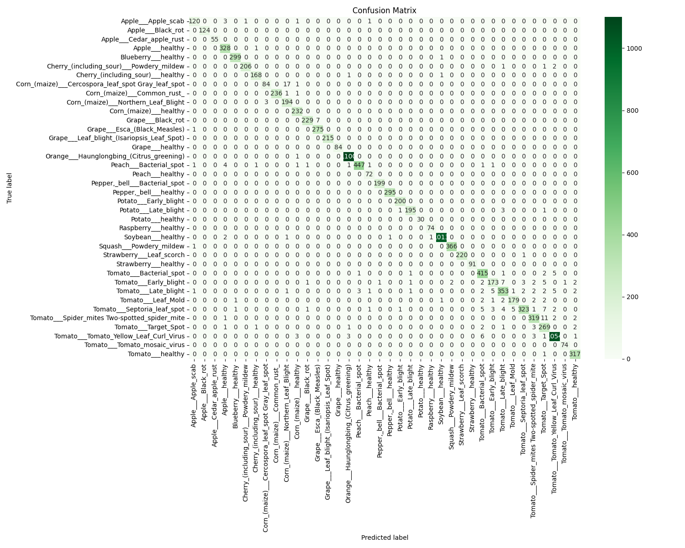

<p align="center">
  
</p>

<h1 align="center">Disease Detection</h1>

<p align="center">
  <strong>An EfficientNet model fine-tuned to recognize plant diseases from leaf images, available via a web API and an offline-first mobile app</strong><br/>
</p>

<!-- BADGES: Go to shields.io to create these. They make your project look professional. -->
<p align="center">
  <a href="https://github.com/MDeus-ai/PlantVision/stargazers"></a>
  <a href="https://github.com/MDeus-ai/PlantVision/blob/main/LICENSE"></a>
  <a href="#"></a>
  <a href="https://muhumuzadeus.netlify.app/projects/plantvision-cv001dd"></a>
</p>


**🌿PlantVision** is a deeplearning-powered plant disease detection system built
with Python and PyTorch. It leverages a CNN architecture (EfficientNet) to classify 84 
different kinds of plant diseases from 17 plants with a relatively high accuracy.


📚You can find the full project documentation [here](https://muhumuzadeus.netlify.app/projects/plantvision-cv001dd)

---
## 🤔 The Problem & Solution

Millions of farmers and gardeners worldwide lose crops to diseases that 
could be managed if caught early. Identifying these diseases often requires 
expert knowledge which isn't always accessible.

**PlantVision** bridges this gap by putting a plant pathologist in your pocket. 
By leveraging a highly efficient deep learning model, it provides an instant and accurate diagnosis from a single image of a plant leaf, 
helping to secure food resources and support sustainable agriculture.

## ✨ Features

- **State-of-the-art Backbone:** Utilizes EfficientNet-B3 for robust feature extraction.
- **Offline Inference:** Optimized for deployment on mobile devices without internet connectivity.
- **Scalable:** The API is containerized with Docker for easy deployment and scaling.
- **Extensibility:** Modular design allows easy customization and extension for additional **plant species** or **diseases**.

---

## 💡 Tech Stack
| Component         | Technology                                                                                                                                                                                                                       |
| ----------------- |----------------------------------------------------------------------------------------------------------------------------------------------------------------------------------------------------------------------------------|
| **Model**         |                                         |
| **Backend (API)** |                  |
| **Mobile**        |  |


---

## 🚀 Installation

Follow these instructions to get the API running on your local machine.

### Prerequisites

- Python 3.8+
- Pip
- Git

### Installation

1.  **Clone the repository:**
    ```bash
    git clone https://github.com/MDeus-ai/PlantVision.git
    cd PlantVision
    pip install -e .
    ```

2.  **Create and activate a virtual environment:**
    ```bash
    python -m venv venv
    venv\Scripts\activate
    ```

3.  **Install the dependencies:**
    ```bash
    pip install -r requirements.txt
    ```

4.  **Download the model file:**
    (Link to the trained `.h5` or `.tflite` model file from Google Drive, etc.)
    ```bash
    # e.g., wget [plantvision_weights.h5] -O models/plant_disease_model.h5
    ```
5. **Use the model from the terminal:**
    ```bash
   plantvision-predict --image "path/to/image.png"
   ```
---
## ⚙️ Usage
### Command-Line (CLI) Usage
Using CLI to interact with PlantVision requires you to open it from the terminal e.g. `command prompt` for windows machines
#### 1. **Use the system to make a prediction:**
- You can use the model to make predictions on images anywhere on your computer by running the following command 
    ```bash
    plantvision-predict --image "path/to/image.png"
    ```
#### 2. **Train the model:**
- Training the model requires you to adapt the system to your custom dataset. This is be done by moving your dataset to the `data/` folder in the **project root** (create the folder if its not available)
- Your custom dataset should be organised with the following structure:
    ```text
    PlantVision/
    ├── data/
    │   └── train/
    │       ├── class_a/
    │       │    ├── 1.png
    │       │    └── 2.png
    │       ├── class_b
    │       │    ├── 3.png
    │       │    └── 4.png
    │       ├── class_c
                 ...
    ```
- Modify the configuration files in `PlantVision/configs/` to match your dataset
    - In `data_config.yaml`: Modify `train_dir` and `val_dir` to match your dataset's structure e.g., `train_dir: "train"` or `train_dir: processed/train/`
    - In `model_config.yaml`: Modify `num_classes` to the number of classes in your dataset e.g., `num_classes: 38`
    - Optionally, you can also modify the **number of epochs** and the **learning rate** from `train_config.yaml`
- With these changes in place, you can now **train the system** with the following command:

    ```bash
    plantvision-train
    ```
- PlantVision will automatically register the class names in your dataset in `outputs/num_classes.json` file for `predict.py` and `evaluate.py` to use later
#### 3. **Evaluate the model:**
- Evaluate the model by running the following command: 
    ```bash
    plantvision-evaluate
    ```
### Other important CLI flags
Some commands have more flags associated with them, that modify the way the system runs
- `--verbose` or `-v`: Only used by the **predict** script, this flag enables PlantVision return more detailed predictions.


- `--model-checkpoint`: Specific to the **evaluate** and **predict** script, this flag takes the path pointing to the trained model .pth file (defaults to `/outputs/best_model.pth`)

**Note:** `plantvision-train` doesn't have any flags associated with it. Instead train specific changes can be done in the `train_config.yaml` file

---
## 🛠️ Model Details
- **Model Architecture** The system uses a family of EfficientNet models introduced in the paper, [EfficientNet: Rethinking Model Scaling for Convolutional Neural Networks](https://arxiv.org/abs/1905.11946), 
pre-trained on ImageNet and fine-tuned for this task.

- **Dataset:** The model was trained on the [link to datasets](link_to_dataset), which contains over 54,000 images of healthy and diseased plant leaves.
<p align="center">
  
</p>

---
## 📄 License

> This project is licensed under the MIT License. See the [LICENSE](LICENSE) file for details.
## 📬 Contact

- **For Direct Inquiries**: You can reach the maintainer, Muhumuza Deus.M. at [muhumuzadeus7@gmail.com](mailto:muhumuzadeus7@gmail.com).

Connect with the creator on social media:
- **Twitter**: [@Muhumuzadeus5](https://x.com/Muhumuzadeus5)
- **LinkedIn**: [linkedin.com/in/MuhumuzaDeusMugenyi](https://www.linkedin.com/in/muhumuza-deus-mugenyi-81a4a7268/)